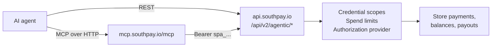

Southpay lets an AI agent operate a merchant store: create payments, watch them settle, read balances and rates, and — once a human has configured the controls — issue refunds and disburse payouts. Agents authenticate with an agent credential (`spa_live_…` / `spa_test_…`), which is a distinct credential type from an API key or an OAuth token.

There are two ways in, and they reach the same endpoints:

- The hosted **[MCP server](/agentic/mcp-server)** at `https://mcp.southpay.io/mcp`, exposing 19 tools to any Model Context Protocol client.
- The **[agentic REST API](/api-reference/agentic)** at `/api/v2/agentic/*`, with `Authorization: Bearer spa_…`.

The MCP server is a thin proxy over the REST API with no logic of its own, so anything gated in one is gated identically in the other. Session mandates and x402 settlements are REST-only.

## What works out of the box

Money movement fails closed. On a store with no extra configuration:

| Capability | Default |
| --- | --- |
| Read account, payments, payouts, balances, tokens, payout limits, exchange rates | Allowed, subject to credential scope |
| Create a payment, cancel a pending payment | Allowed |
| Refund a payment | Blocked — `403 mandate_required` |
| Enable or disable an accepted token | Blocked — `403 mandate_required` |
| Create a payout | Blocked — `403 payout_controls_required` until a spend limit exists for the asset |
| Issue a session mandate, settle an x402 charge | Blocked — `403 mandate_required` |
| Read public token market data | Allowed, no credential required |

Spend limits are configured by the merchant in the dashboard. The rest need an authorization provider, which Southpay support enables per store. [Agent authorization](/agentic/authorization) covers exactly what unblocks what.

## How the pieces fit

- **[Agent credentials](/agentic/agent-credentials)** — bearer tokens carrying up to eight scopes and an optional expiry, created by the merchant in the dashboard or minted through the OAuth exchange.
- **[Authorization](/agentic/authorization)** — three controls that compose: credential scopes, per-asset spend limits with a daily counter, and mandates verified by an authorization provider.
- **[MCP server](/agentic/mcp-server)** — connection, sessions, browser login, and the full tool reference.
- **[x402 and session mandates](/agentic/x402)** — capped envelopes for pay-per-call machine-to-machine commerce. Ledger-only unless on-chain dispatch is enabled.

## Isolation

An agent sees only its own records. Every agentic query is filtered by the calling credential, so payments, payouts, refunds and settlements created by one credential are invisible to another on the same store. An agent also cannot manage credentials — not its own, and not any other.

Credentials are mode-locked by their prefix. A `spa_test_` credential sees only test-mode data, where the single usable asset is `SETH` on Ethereum Sepolia. A `spa_live_` credential sees only live data. There is no mode header on the agentic API.

## Rate limits

Agentic endpoints allow **120 requests per minute per credential**, returning `429` with code `rate_limited` when exceeded. No `Retry-After` header is set, so back off on your own schedule.

`GET /api/v2/agentic/market_data` is the exception: it is deliberately unauthenticated and limited to 30 requests per minute per IP.

## Get started

<Columns cols={2}>
  <Card title="Quickstart" icon="rocket" href="/agentic/quickstart">
    Create a credential, connect a client, and take an agent-driven payment.
  </Card>
  <Card title="MCP server" icon="plug" href="/agentic/mcp-server">
    Connection, browser login, and all 19 tools with their parameters.
  </Card>
  <Card title="Authorization" icon="shield" href="/agentic/authorization">
    What is blocked by default and what unblocks it.
  </Card>
  <Card title="API reference" icon="code" href="/api-reference/agentic">
    Every `/api/v2/agentic/*` endpoint with request and response shapes.
  </Card>
</Columns>
