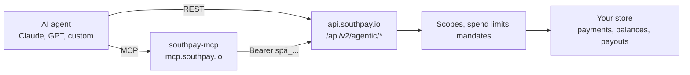

Southpay lets an AI agent operate a merchant store directly: create payments, watch them complete, issue refunds, manage accepted tokens, and disburse payouts. Agents connect through a hosted [MCP server](/agentic/mcp-server) or call the [agentic REST API](/api-reference/agentic) with a scoped agent credential.

The design assumption is that agents make mistakes. Every capability an agent has is bounded by an explicit control a human configured first, and money movement **fails closed**: if no control is configured, the action is denied.

## What an agent can do

| Capability | Gating |
| --- | --- |
| Read account, balances, payments, payouts, rates | Credential scope only |
| Create and cancel payments | Scope + authorization provider (if enabled) |
| Wait for a payment to complete | Scope only |
| Issue refunds | Scope + mandate required |
| Enable or disable accepted tokens | Scope + mandate required |
| Create payouts | Scope + spend limits or mandate, fail-closed |
| Issue x402 session mandates and settle per-call charges | Scope + mandate, capped envelope |
| Research token prices (CoinGecko) | None - public data, no credential needed |

## How it fits together

- **[Agent credentials](/agentic/agent-credentials)** - bearer tokens with the prefix `spa_live_` or `spa_test_`, created by the merchant in the dashboard. Each carries a set of scopes and an optional expiry.
- **[MCP server](/agentic/mcp-server)** - a hosted Model Context Protocol server at `https://mcp.southpay.io/mcp` exposing 19 tools. Works with Claude, Claude Code, and any MCP-capable client.
- **[Authorization](/agentic/authorization)** - three independent safety layers: credential scopes, per-asset spend limits with daily counters, and cryptographic mandates verified through an authorization provider (HumanOS).
- **[x402 and session mandates](/agentic/x402)** - capped spending envelopes for machine-to-machine, pay-per-call commerce.

## Test mode first

Agent credentials are mode-specific. A `spa_test_` credential only sees testnet assets and test-mode data; a `spa_live_` credential only sees live data. Start every integration with a test credential - the API surface is identical.

## Get started

<CardGroup cols={2}>
  <Card title="Quickstart" icon="rocket" href="/agentic/quickstart">
    Create a credential and take your first agent-driven payment in minutes.
  </Card>
  <Card title="MCP server" icon="plug" href="/agentic/mcp-server">
    Connect Claude or any MCP client and browse the full tool reference.
  </Card>
  <Card title="Authorization" icon="shield" href="/agentic/authorization">
    Understand scopes, spend limits, mandates, and the fail-closed rules.
  </Card>
  <Card title="API reference" icon="code" href="/api-reference/agentic">
    Every `/api/v2/agentic/*` endpoint with request and response shapes.
  </Card>
</CardGroup>
