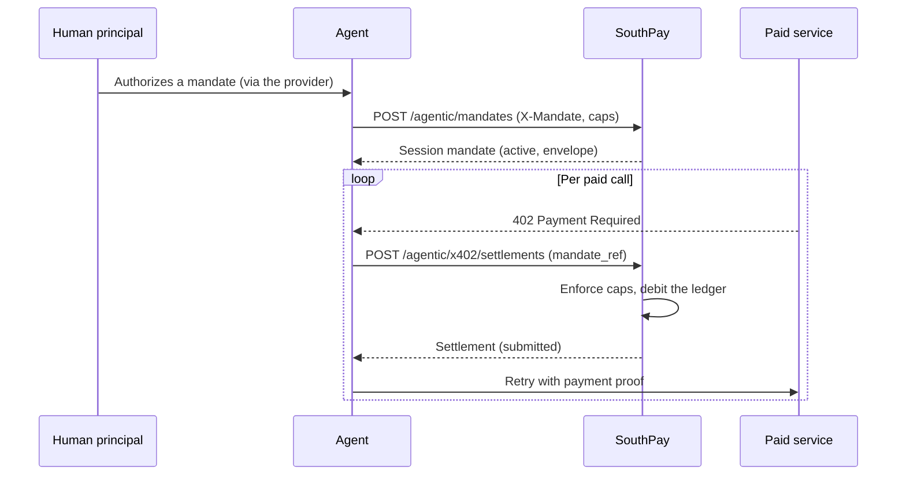

x402 is a pattern for machine-to-machine payments: a service answers `402 Payment Required`, the agent pays, the service delivers. Charging per call makes per-action human approval impractical, so SouthPay uses **session mandates** — a human authorizes a capped envelope once, and the agent draws against it call by call under local, deterministic enforcement.

Both resources are REST-only, under the `x402:read` and `x402:write` scopes. Neither is exposed as an MCP tool.

## Two things are off by default

Read this before building against x402. On a store with no configuration, the flow does not run at all, and even with it running the money does not leave the chain-side.

**Mandate issuance requires an authorization provider.** `POST /agentic/mandates` returns `403 mandate_required` unless a provider is configured for the store. There is no API to configure one and no dashboard toggle — SouthPay support sets it per store. Because a settlement needs a usable mandate, `POST /agentic/x402/settlements` is blocked by the same wall. On a default store, every x402 write returns `403`.

**On-chain dispatch is off by default.** Settlements are a ledger accrual, not a transfer. SouthPay broadcasts a settlement on-chain only when all of the following hold:

- on-chain dispatch is enabled for the store — it is off unless SouthPay staff turn it on;
- the settlement is in **live mode** — test-mode settlements are never dispatched;
- `amount_atomic` is non-zero;
- `pay_to` is set — a settlement without one is failed with reason `missing_pay_to`.

With dispatch off, a settlement stays `submitted` indefinitely and `tx_ref` stays `null`. The spend is real on SouthPay's internal ledger — it reduces the store balance and the mandate envelope — but no on-chain transfer exists. Do not treat `submitted` as settlement finality, and do not release goods against it.

<Warning>
  Polling a `submitted` settlement for `confirmed` on a store without on-chain dispatch is an infinite loop. Confirm dispatch is enabled with your SouthPay contact before you build a state machine that waits on it.
</Warning>

## How the flow runs



Issuance is verified once through the store's [authorization provider](/agentic/authorization). Every subsequent draw is enforced locally against the envelope's caps and the store balance, with no per-call round trip to the provider.

## Issue a session mandate

<CodeGroup>
```bash Request
curl -X POST https://api.southpay.io/api/v2/agentic/mandates \
  -H "Authorization: Bearer spa_live_..." \
  -H "X-Mandate: <base64 presentation>" \
  -H "Content-Type: application/json" \
  -d '{
    "asset_id": "ETH_USDC",
    "mandate_ref": "research-session-42",
    "total_cap_atomic": "5000000",
    "per_call_cap_atomic": "250000",
    "expires_in_seconds": 3600
  }'
```

```json Response 201
{
  "id": "a3e91c47-08bd-4f52-9b17-6c2ad4e0f831",
  "scope": "x402",
  "mandate_ref": "research-session-42",
  "status": "active",
  "asset_id": "ETH_USDC",
  "total_cap_atomic": "5000000",
  "per_call_cap_atomic": "250000",
  "spent_atomic": "0",
  "remaining_atomic": "5000000",
  "authorization_provider": "humanos",
  "expires_at": "2026-07-12T13:00:00.000Z",
  "revoked_at": null,
  "livemode": true,
  "created_at": "2026-07-12T12:00:00.000Z",
  "updated_at": "2026-07-12T12:00:00.000Z"
}
```
</CodeGroup>

| Field | Notes |
| --- | --- |
| `asset_id` | Required. The asset the envelope spends |
| `mandate_ref` | Required. Your reference for the session; settlements name the mandate by this |
| `total_cap_atomic` | Required, must be positive. Envelope total in atomic units |
| `per_call_cap_atomic` | Optional per-settlement cap |
| `expires_in_seconds` | Defaults to 3600 |
| `scope` | Defaults to `x402` |

`mandate_ref` is unique per credential and issuance is idempotent on it: posting the same `mandate_ref` again returns the existing mandate rather than creating a second one or raising a conflict.

Failures: `403 mandate_required` with no provider, `403 authorization_denied` when a provider evaluates and refuses, `404 asset_not_found`, `422 invalid_cap` for a non-positive total, `422 mandate_ref_required`.

A mandate is usable while `status` is `active`, it has not expired, and `remaining_atomic` is positive.

| Status | Meaning |
| --- | --- |
| `active` | Usable |
| `revoked` | Withdrawn before expiry |
| `expired` | Past `expires_at` |
| `exhausted` | A draw consumed the last of the envelope |

`GET /agentic/mandates` lists the credential's mandates, capped at the 100 most recent. `GET /agentic/mandates/:id` fetches one.

## Settle a charge

Each paid call becomes one settlement drawing on the mandate.

<CodeGroup>
```bash Request
curl -X POST https://api.southpay.io/api/v2/agentic/x402/settlements \
  -H "Authorization: Bearer spa_live_..." \
  -H "Idempotency-Key: research-session-42-call-007" \
  -H "Content-Type: application/json" \
  -d '{
    "asset_id": "ETH_USDC",
    "mandate_ref": "research-session-42",
    "amount_atomic": "120000",
    "pay_to": "0x9aB4c17E3f8025dA61b7C4e09fD3a5528b1c0E67",
    "nonce": "a1b2c3d4e5f6a7b8"
  }'
```

```json Response 201
{
  "id": "6c84b0d2-95f1-4a37-8e5b-1d70c9a4f2e8",
  "status": "submitted",
  "amount_atomic": "120000",
  "asset_id": "ETH_USDC",
  "mandate_ref": "research-session-42",
  "nonce": "a1b2c3d4e5f6a7b8",
  "pay_to": "0x9aB4c17E3f8025dA61b7C4e09fD3a5528b1c0E67",
  "payer": null,
  "tx_ref": null,
  "failure_reason": null,
  "livemode": true,
  "created_at": "2026-07-12T12:04:11.000Z",
  "updated_at": "2026-07-12T12:04:11.000Z"
}
```
</CodeGroup>

`Idempotency-Key` is required; without it the request is refused with `422 idempotency_key_required`. Retrying with the same key returns the original settlement, with the normal `201`.

`nonce` defaults to a random 32-character hex value. `payer` and `requirements` — the service's own 402 payment requirements, stored for audit — are optional.

`amount_atomic` must not be negative, and **zero is accepted**. A zero-amount settlement records the call against the mandate without drawing on the envelope, and is never dispatched on-chain.

Under a row lock on the mandate, each settlement:

1. confirms the mandate is usable, otherwise `403 mandate_required`;
2. enforces the per-call cap and the remaining envelope, otherwise `403 spend_cap_exceeded`;
3. confirms the store balance covers the amount, otherwise `422 insufficient_balance`;
4. records the debit on the double-entry ledger and increments `spent_atomic`, flipping the mandate to `exhausted` if that consumes the envelope.

`GET /agentic/x402/settlements` lists settlements with a `pagination` envelope (`page`, `per_page` default 25 max 100, `total`, `total_pages`). `GET /agentic/x402/settlements/:id` fetches one.

## Settlement status

| Status | Meaning |
| --- | --- |
| `pending` | Created but not yet enforced |
| `submitted` | Enforced against the envelope and recorded on the ledger. **Not an on-chain transfer** |
| `confirmed` | On-chain transfer confirmed. Only reachable with on-chain dispatch enabled, in live mode |
| `failed` | Dispatch failed; `failure_reason` is set. Same preconditions |

`confirmed` and `failed` are terminal. Without on-chain dispatch a settlement finishes its life as `submitted`, which is the state most integrations will see today.

If dispatch is enabled for your store, `tx_ref` carries the provider transaction reference once broadcast. Dispatch is keyed deterministically per settlement, so a retry cannot double-send.
