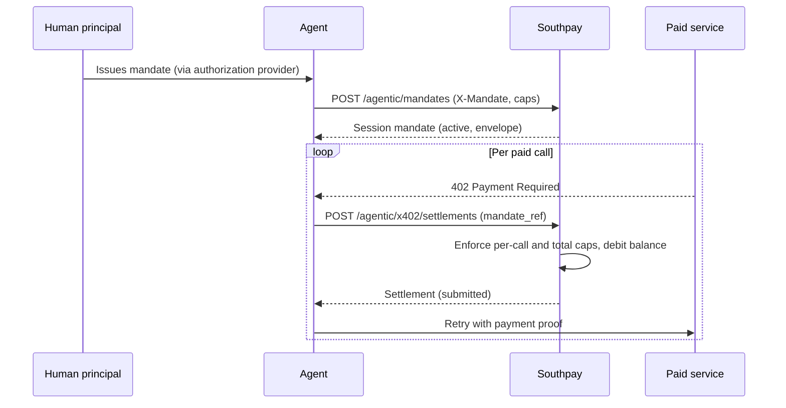

x402 is a pattern for machine-to-machine payments: a service responds `402 Payment Required`, the agent pays, the service delivers. Charging per call makes per-action human approval impractical, so Southpay uses **session mandates**: the human authorizes a capped spending envelope once, and the agent draws against it call by call with local, deterministic enforcement.

Both resources are REST-only (`x402:read` / `x402:write` scopes); they are not exposed as MCP tools.

<Note>
  x402 settlements are recorded on Southpay's ledger with status `submitted`, which is a balance accrual, not on-chain finality. On-chain dispatch and confirmation are on the roadmap; until then, do not treat a `submitted` settlement as an on-chain transfer. See [Settlement status](#settlement-status).
</Note>

## How it works



Issuing a mandate is itself a gated action, verified once through the store's [authorization provider](/agentic/authorization). Every subsequent draw is enforced locally by Southpay against the envelope's caps and the store balance - no per-call round trip to the provider.

## Issue a session mandate

<CodeGroup>
```bash Request
curl -X POST https://api.southpay.io/api/v2/agentic/mandates \
  -H "Authorization: Bearer spa_live_..." \
  -H "X-Mandate: <base64 presentation>" \
  -H "Content-Type: application/json" \
  -d '{
    "asset_id": "ETH_USDC",
    "mandate_ref": "research-session-42",
    "total_cap_atomic": "5000000",
    "per_call_cap_atomic": "250000",
    "expires_in_seconds": 3600
  }'
```

```json Response 201
{
  "id": "01HZ...",
  "scope": "x402",
  "mandate_ref": "research-session-42",
  "status": "active",
  "asset_id": "ETH_USDC",
  "total_cap_atomic": "5000000",
  "per_call_cap_atomic": "250000",
  "spent_atomic": "0",
  "remaining_atomic": "5000000",
  "authorization_provider": "<provider>",
  "expires_at": "2026-07-12T13:00:00.000Z",
  "revoked_at": null,
  "livemode": true,
  "created_at": "2026-07-12T12:00:00.000Z"
}
```
</CodeGroup>

| Field | Notes |
| --- | --- |
| `asset_id` | Asset the envelope spends (required) |
| `mandate_ref` | Your reference for the session; settlements name the mandate by this ref (required) |
| `total_cap_atomic` | Envelope total, atomic units (required, positive) |
| `per_call_cap_atomic` | Optional per-settlement cap |
| `expires_in_seconds` | Default 3600 |
| `scope` | Default `x402` |

Without an authorization provider, issuance is denied with `mandate_required`; a provider denial returns `authorization_denied`. A mandate is usable while `status` is `active`, unexpired, and `remaining_atomic` is positive. Statuses: `active`, `revoked`, `expired`, `exhausted` (a draw that consumes the last of the envelope flips it to `exhausted`).

`GET /agentic/mandates` lists the credential's mandates; `GET /agentic/mandates/:id` fetches one.

## Settle a charge

Each paid call becomes one settlement drawing on the mandate:

<CodeGroup>
```bash Request
curl -X POST https://api.southpay.io/api/v2/agentic/x402/settlements \
  -H "Authorization: Bearer spa_live_..." \
  -H "Idempotency-Key: research-session-42-call-007" \
  -H "Content-Type: application/json" \
  -d '{
    "asset_id": "ETH_USDC",
    "mandate_ref": "research-session-42",
    "amount_atomic": "120000",
    "pay_to": "0x9aB4...",
    "nonce": "a1b2c3d4e5f6a7b8"
  }'
```

```json Response 201
{
  "id": "01HZ...",
  "status": "submitted",
  "amount_atomic": "120000",
  "asset_id": "ETH_USDC",
  "mandate_ref": "research-session-42",
  "nonce": "a1b2c3d4e5f6a7b8",
  "pay_to": "0x9aB4...",
  "payer": null,
  "tx_ref": null,
  "failure_reason": null,
  "livemode": true,
  "created_at": "2026-07-12T12:04:11.000Z"
}
```
</CodeGroup>

`Idempotency-Key` is required; retrying with the same key returns the original settlement. `nonce` defaults to a random value if omitted; `payer` and `requirements` (the service's 402 payment requirements, stored for audit) are optional.

Each settlement, under a row lock on the mandate:

1. Confirms the mandate is usable (`mandate_required` otherwise).
2. Enforces the per-call cap and the remaining envelope (`spend_cap_exceeded`).
3. Confirms the store balance covers the amount (`insufficient_balance`).
4. Records the debit on the double-entry ledger and increments `spent_atomic`.

`GET /agentic/x402/settlements` lists settlements (paginated); `GET /agentic/x402/settlements/:id` fetches one.

## Settlement status

| Status | Meaning |
| --- | --- |
| `submitted` | Recorded and enforced against the envelope; funds accrued on the ledger. **Not on-chain final** |
| `confirmed` | On-chain transfer confirmed. Roadmap |
| `failed` | On-chain transfer failed; `failure_reason` set. Roadmap |

Today settlements remain `submitted`: the spend is real on the Southpay ledger (it reduces the store balance and the envelope) but no on-chain transfer is dispatched. When on-chain dispatch ships, `tx_ref` will carry the transaction reference and settlements will progress to `confirmed` or `failed`. Build against the terminal statuses now and nothing changes for you later.
