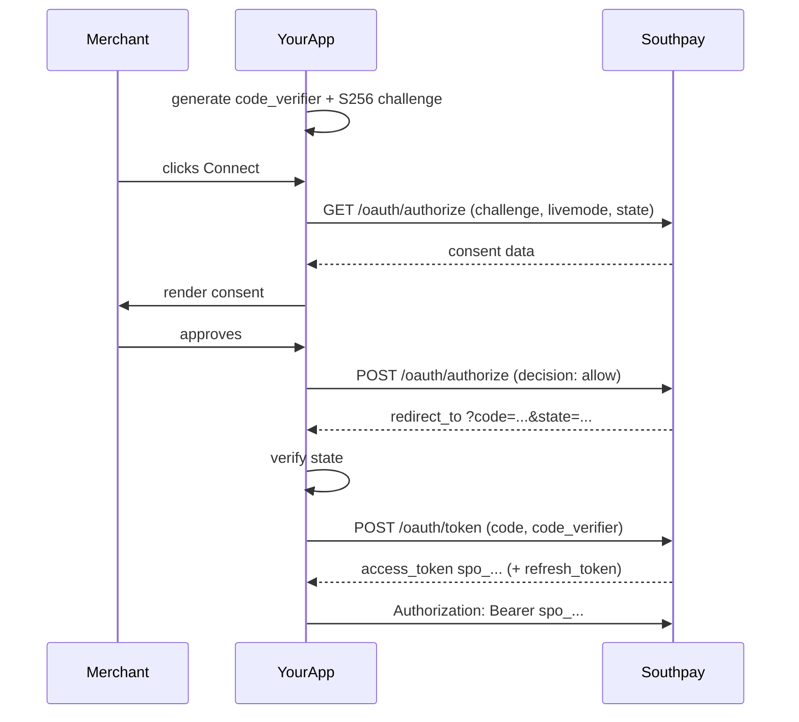

Every request carries `Authorization: Bearer <token>`. The prefix on the token decides which credential type Southpay authenticates it as, and which store and mode the request runs in.

| Credential | Prefix | For |
| --- | --- | --- |
| Secret API key | `sp_sk_live_` / `sp_sk_test_` | Your own server-side integration |
| Publishable API key | `sp_pk_live_` / `sp_pk_test_` | Browser code. Can only create payments. |
| OAuth access token | `spo_` | An application acting for a merchant who authorized it |
| Agent credential | `spa_live_` / `spa_test_` | An AI agent on the [agentic API](/agentic/index) |

There is no separate sandbox host. **Test and live mode are carried on the credential**, so `sp_sk_test_…` reads and writes test data and `sp_sk_live_…` reads and writes live data, on the same base URL. See [Environments](/environments).

You never send `X-Store-Id` or `X-Livemode` with an API key, OAuth token or agent credential. Both are implied by the credential. Those two headers exist only for logged-in dashboard sessions, which are not part of the public API.

## API keys

Create keys in the [dashboard](https://app.southpay.io) under **Settings → API keys**. Choose the mode (live or test) and the type (secret or publishable). The full key value is shown once, at creation. There is no endpoint that returns it again, and Southpay stores only a SHA-256 hash.

```bash
curl https://api.southpay.io/api/v2/payments \
  -H "Authorization: Bearer sp_sk_test_YOUR_KEY"
```

<Danger>
A secret key is full access to a store's money, bounded only by its scopes. Never put one in client-side code, a mobile binary, a public repository, or a URL. If one leaks, revoke it in the dashboard before you do anything else — rotation is instant and the old value stops working immediately.
</Danger>

Keys issued before key types existed use the bare `sp_live_…` / `sp_test_…` prefix. They still authenticate and behave as secret keys. Nothing generates that form any more.

### Publishable keys

A publishable key may call exactly one endpoint: `POST /api/v2/payments`. Every other path returns `403` with code `publishable_key_forbidden`. Its scope set is fixed to `payments:write` and cannot be widened.

That restriction is the whole security model, so a publishable key is safe to embed in a page. It cannot read the payments it creates, list anything, or move money.

### Scopes

Fifteen scopes exist. A new secret key gets all of them except the three `accounts:` scopes, which are added only for [platform accounts](/platform-accounts).

| Scope | Grants |
| --- | --- |
| `payments:read` | List and read payment intents, their events, and reconciliation |
| `payments:write` | Create payment intents |
| `refunds:read` | List and read refunds |
| `refunds:write` | Create refunds |
| `payouts:read` | List and read payouts and payout schedules |
| `payouts:write` | Create, retry and quote payouts; manage payout schedules |
| `balances:read` | Read balances and reports |
| `billing:read` | Read customers, invoices, products, prices and subscriptions |
| `billing:write` | Manage all of the above |
| `webhooks:read` | Read webhook endpoints and their deliveries |
| `webhooks:write` | Create, update, rotate and delete webhook endpoints |
| `stores:read` | Read store details |
| `accounts:read` | Read your platform's sub-merchants |
| `accounts:write` | Create and update sub-merchants, verification and onboarding links |
| `accounts:act` | Send `X-Southpay-Account` to act as a sub-merchant |

Holding `<resource>:write` implies `<resource>:read`. A scope check that fails returns `403` with code `insufficient_scope`.

The required scope is derived from the resource and the HTTP verb: any method other than `GET` or `HEAD` needs `:write`. Reports map to the `balances` resource, not their own.

<Note>
Some endpoints are not in the scope map at all and accept any valid credential: balance swaps, connected integrations, OAuth connections and verification requests. Do not read a narrow scope list as a guarantee that a key cannot reach those.
</Note>

### Acting as a sub-merchant

A platform sends `X-Southpay-Account: <account_id>` alongside its own credential to run any merchant endpoint against one of its sub-merchants. It requires `accounts:act`, and the platform feature must be enabled on your store. See [Platform accounts](/platform-accounts).

## OAuth 2.0

Use OAuth when you are building an application that other merchants connect to their own Southpay accounts. The flow is Authorization Code with PKCE.

<Warning>
**PKCE is mandatory and only `S256` is accepted.** A request without `code_challenge` is rejected with `invalid_request`. `plain` is not supported. This applies to confidential clients too — a client secret does not exempt you.
</Warning>

Register the application first; see [OAuth apps](/oauth-apps) for that. The discovery document at `https://api.southpay.io/.well-known/oauth-authorization-server` advertises the endpoints, `response_types_supported: ["code"]`, `grant_types_supported: ["authorization_code", "refresh_token"]`, and `code_challenge_methods_supported: ["S256"]`.

### Available scopes

Eighteen scopes may be requested. The first fifteen mirror the API key scopes above.

`profile` · `stores:read` · `payments:read` · `payments:write` · `refunds:read` · `refunds:write` · `payouts:read` · `payouts:write` · `balances:read` · `billing:read` · `billing:write` · `webhooks:read` · `webhooks:write` · `accounts:read` · `accounts:write` · `accounts:act` · `agents:write` · `offline_access`

| Scope | Grants |
| --- | --- |
| `profile` | The merchant's name and email, via `GET /oauth/userinfo` |
| `agents:write` | Exchange the token for an `spa_` agent credential at `POST /oauth/agent_credentials` |
| `offline_access` | Issue a refresh token alongside the access token |

<Note>
The consent screen currently renders no description for `accounts:read`, `accounts:write`, `accounts:act` and `agents:write`. Merchants approving those scopes see the name only. If your app requests them, explain them in your own UI before you send the merchant to the authorize page.
</Note>

### Step 1 — generate the PKCE pair

<CodeGroup>
```typescript pkce.ts
import { createHash, randomBytes } from "node:crypto";

const codeVerifier = randomBytes(32).toString("base64url");
const codeChallenge = createHash("sha256").update(codeVerifier).digest("base64url");
```

```python pkce.py
import base64
import hashlib
import secrets

code_verifier = secrets.token_urlsafe(32)
code_challenge = (
    base64.urlsafe_b64encode(hashlib.sha256(code_verifier.encode()).digest())
    .rstrip(b"=")
    .decode()
)
```
</CodeGroup>

Keep `code_verifier` server-side and bound to the session. You send it only in step 3.

### Step 2 — authorize

```http Authorize request
GET https://api.southpay.io/api/v2/oauth/authorize
  ?client_id=YOUR_CLIENT_ID
  &redirect_uri=https://yourapp.example/oauth/callback
  &scope=profile+payments:read+payments:write+offline_access
  &code_challenge=BASE64URL_CHALLENGE
  &code_challenge_method=S256
  &state=RANDOM_CSRF_TOKEN
  &livemode=true
```

**`livemode` selects the mode for the whole grant.** Pass `livemode=true` for production access. The mode is recorded on the authorization code, copied onto the access token, and cannot be changed afterwards — a token issued in test mode can never read live data, and there is no header that overrides it. Omitting the parameter yields a test-mode grant.

The `GET` returns consent data as JSON: the application, the requested scopes, and the merchant's stores. Render your own consent UI from it, then post the decision.

```bash
curl -X POST https://api.southpay.io/api/v2/oauth/authorize \
  -H "Content-Type: application/json" \
  -d '{
    "client_id": "YOUR_CLIENT_ID",
    "redirect_uri": "https://yourapp.example/oauth/callback",
    "scope": "profile payments:read payments:write offline_access",
    "code_challenge": "BASE64URL_CHALLENGE",
    "code_challenge_method": "S256",
    "state": "RANDOM_CSRF_TOKEN",
    "store_id": "STORE_UUID",
    "livemode": true,
    "decision": "allow"
  }'
```

The response is `{"redirect_to": "https://yourapp.example/oauth/callback?code=…&state=…"}`. Send the browser there, and compare the returned `state` to what you issued before doing anything else.

Authorization codes live for **10 minutes** and are single use.

### Step 3 — exchange the code

<CodeGroup>
```bash Request
curl -X POST https://api.southpay.io/api/v2/oauth/token \
  -H "Content-Type: application/json" \
  -d '{
    "grant_type": "authorization_code",
    "client_id": "YOUR_CLIENT_ID",
    "code": "AUTH_CODE",
    "redirect_uri": "https://yourapp.example/oauth/callback",
    "code_verifier": "YOUR_CODE_VERIFIER"
  }'
```

```json Response 200
{
  "access_token": "spo_a1b2c3d4e5f6...",
  "token_type": "Bearer",
  "expires_in": 3600,
  "scope": "profile payments:read payments:write offline_access",
  "store_id": "8d2f6c1a-4b70-4e39-9a55-c1e07f34b8d2",
  "livemode": true,
  "refresh_token": "spr_...",
  "refresh_token_expires_in": 7776000
}
```
</CodeGroup>

Confidential clients also send `client_secret`, in the body or by HTTP Basic auth.

### Token lifetimes

The access token's lifetime is set by the scopes you asked for, not by a fixed policy.

<Warning>
**`expires_in` depends on whether you asked for `offline_access`, and the two lifetimes never appear together.**

- **With `offline_access`**: the access token lives **3600 seconds**, and a refresh token is issued. Build a refresh loop; a one-hour token will expire mid-session.
- **Without `offline_access`**: the access token lives **7,776,000 seconds (90 days)** and there is no refresh token. When it expires you re-run the whole authorization flow.

An `expires_in` of 7776000 alongside a `refresh_token` is not a response this API produces.
</Warning>

Refresh tokens last 90 days and are single use — each refresh rotates them and returns a new one. Store the new value on every refresh.

```bash
curl -X POST https://api.southpay.io/api/v2/oauth/token \
  -H "Content-Type: application/json" \
  -d '{
    "grant_type": "refresh_token",
    "client_id": "YOUR_CLIENT_ID",
    "refresh_token": "spr_..."
  }'
```

Replaying a rotated refresh token within about 60 seconds is tolerated as a concurrency race and returns a valid pair. Replaying one later is treated as theft: the whole token family is revoked and the merchant must reauthorize.

### Using and revoking

```bash
curl https://api.southpay.io/api/v2/payments \
  -H "Authorization: Bearer spo_a1b2c3d4e5f6..."
```

An OAuth token is bound to one store and one mode. It carries the granted scopes and is checked against exactly the same scope map as an API key.

```bash
curl -X POST https://api.southpay.io/api/v2/oauth/revoke \
  -H "Content-Type: application/json" \
  -d '{"token": "spo_a1b2c3d4e5f6..."}'
```

Revocation returns `200` with an empty body.

<Note>
OAuth endpoints return errors in the RFC 6749 shape, `{"error": "invalid_request", "error_description": "…"}`, which is not the shape the rest of the API uses. See [Errors](/errors).
</Note>

### Flow


```mermaid
sequenceDiagram
  participant Merchant
  participant YourApp
  participant Southpay

  YourApp->>YourApp: generate code_verifier + S256 challenge
  Merchant->>YourApp: clicks Connect
  YourApp->>Southpay: GET /oauth/authorize (challenge, livemode, state)
  Southpay-->>YourApp: consent data
  YourApp->>Merchant: render consent
  Merchant->>YourApp: approves
  YourApp->>Southpay: POST /oauth/authorize (decision: allow)
  Southpay-->>YourApp: redirect_to ?code=...&state=...
  YourApp->>YourApp: verify state
  YourApp->>Southpay: POST /oauth/token (code, code_verifier)
  Southpay-->>YourApp: access_token spo_... (+ refresh_token)
  YourApp->>Southpay: Authorization: Bearer spo_...
```

## Agent credentials

`spa_live_` and `spa_test_` credentials authenticate the `/api/v2/agentic/*` surface and nothing else. A regular API key is rejected there, and an agent credential is rejected everywhere else.

Their scope set is different and smaller: `payments:read`, `payments:write`, `payouts:read`, `payouts:write`, `assets:read`, `assets:write`, `x402:read`, `x402:write`. The agentic API is also rate limited at 120 requests per minute per credential.

An agent only ever sees records it created. See [Agent credentials](/agentic/agent-credentials).

## Choosing

| | API key | OAuth | Agent credential |
| --- | --- | --- | --- |
| Created by | The store owner, in the dashboard | The merchant, by authorizing your app | The store owner, or an OAuth exchange |
| Store context | Fixed to the key's store | The store granted at authorize time | Fixed to the credential's store |
| Mode | Fixed by the key prefix | Fixed by `livemode` at authorize time | Fixed by the credential prefix |
| Expiry | Until revoked | 1 hour with refresh, 90 days without | Optional expiry set at creation |
| Surface | Public API | Public API | `/api/v2/agentic/*` only |
| Use for | Your own backend | An app other merchants install | Autonomous agents |

## Endpoints you cannot reach with these credentials

Several parts of the API accept only a logged-in dashboard session, and return `401` for an API key or OAuth token. They are not part of the public API and no integration should depend on them:

API keys and agent credentials themselves, agent spend limits, [payout destinations](/payout-destinations), custom domains, store records and store settings, merchant-owned OAuth apps, and the reference-data endpoints `supported_assets`, `networks` and `payment_currencies`.

Where you need one of those, configure it in the dashboard. The catalogue of assets and currencies is documented on [Supported currencies and assets](/currencies) so you do not need to call those endpoints at all.
