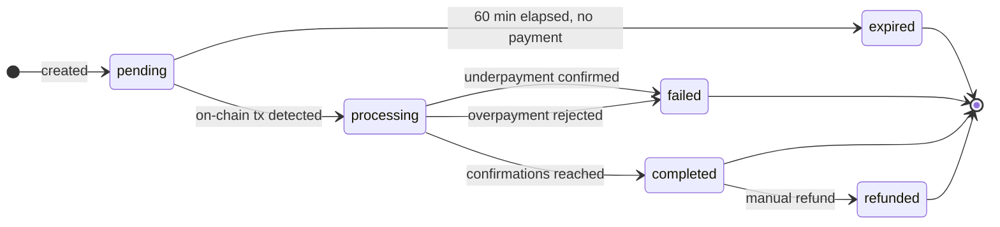
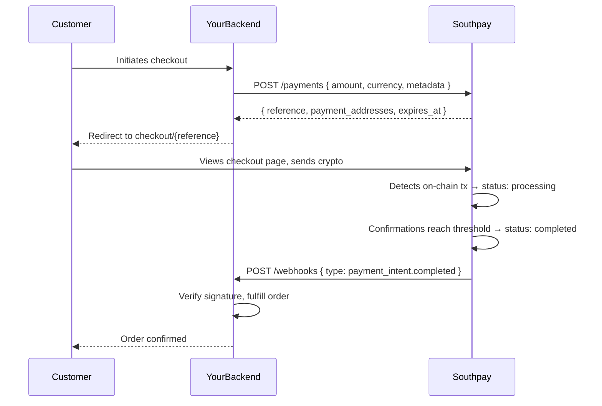

## What is a Payment Intent?

A Payment Intent represents a single, atomic payment request. You specify a fiat amount and currency; Southpay calculates the equivalent crypto amount at the current exchange rate and allocates a deposit address for each blockchain your store supports.

The intent captures a rate snapshot at creation time, so the customer always knows the exact crypto amount to send.

---

## Create a Payment Intent

```bash
POST /api/v2/payments
Authorization: Bearer sp_test_YOUR_KEY
Content-Type: application/json
Idempotency-Key: order_8721_attempt_1   # optional but recommended
```

```json
{
  "payment_intent": {
    "amount": "149.00",
    "currency": "USD",
    "success_url": "https://yourapp.com/success",
    "failed_url": "https://yourapp.com/cancel",
    "metadata": {
      "order_id": "order_8721",
      "customer_id": "cus_4421"
    }
  }
}
```

### Request parameters

| Parameter | Type | Required | Description |
| --- | --- | --- | --- |
| `amount` | string | Yes | Decimal fiat amount (e.g. `"149.00"`) |
| `currency` | string | Yes | ISO 4217 fiat code. Supported: `USD`, `EUR`, `GBP`, `HKD`, `SGD`, `JPY` |
| `success_url` | string | No | Redirect URL after confirmed payment |
| `failed_url` | string | No | Redirect URL after failed or expired payment |
| `metadata` | object | No | Up to 50 key-value pairs (string values). Returned verbatim in all events. |
| `Idempotency-Key` | header | No | Unique string. Repeat requests with the same key return the original intent. See [Idempotency](/idempotency). |

### Response

```json
{
  "id": "018f1a2b-3c4d-7e5f-9a0b-1c2d3e4f5a6b",
  "reference": "A1B2C3D4E5F6G7H8",
  "status": "pending",
  "state_reason": null,
  "settlement_currency": "USD",
  "settlement_amount": "149.00",
  "expires_at": "2026-04-19T15:00:00.000Z",
  "created_at": "2026-04-19T14:00:00.000Z",
  "success_url": "https://yourapp.com/success",
  "failed_url": "https://yourapp.com/cancel",
  "terminal": false,
  "payment_addresses": [
    {
      "id": "018f1a2b-0001-7000-8000-000000000001",
      "address": "0xAbCdEf1234567890AbCdEf1234567890AbCdEf12",
      "status": "pending",
      "crypto_amount_atomic": "67215000000000000",
      "exchange_rate_snapshot": "2218.50",
      "supported_asset": {
        "asset_id": "ETH_ETH",
        "coin_symbol": "ETH",
        "chain_symbol": "ETH",
        "atomic_decimals": 18
      }
    },
    {
      "id": "018f1a2b-0002-7000-8000-000000000002",
      "address": "0xAbCdEf1234567890AbCdEf1234567890AbCdEf12",
      "status": "pending",
      "crypto_amount_atomic": "149000000",
      "exchange_rate_snapshot": "1.00",
      "supported_asset": {
        "asset_id": "USDC_ETH_ERC20",
        "coin_symbol": "USDC",
        "chain_symbol": "ETH",
        "token_standard": "ERC20",
        "atomic_decimals": 6
      }
    }
  ]
}
```

### Response fields

| Field | Type | Description |
| --- | --- | --- |
| `id` | string (UUID) | Unique identifier |
| `reference` | string | 16-character alphanumeric. Used in the checkout URL and displayed to customers. |
| `status` | string | Current lifecycle state (see [Lifecycle](#lifecycle)) |
| `state_reason` | string \| null | Machine-readable reason for the current status |
| `settlement_currency` | string | The fiat currency you specified |
| `settlement_amount` | string | The fiat amount as a decimal string |
| `expires_at` | ISO 8601 | When the intent expires (60 minutes after creation) |
| `terminal` | boolean | `true` when the intent is in a final state and will not change |
| `payment_addresses` | array | One entry per blockchain. See below. |

### Payment address fields

| Field | Type | Description |
| --- | --- | --- |
| `address` | string | The on-chain deposit address for this asset |
| `crypto_amount_atomic` | string | Exact amount to send in smallest units (e.g. wei) |
| `exchange_rate_snapshot` | string | Fiat/crypto rate used at creation time |
| `supported_asset.atomic_decimals` | integer | Decimal places for the asset. Divide `crypto_amount_atomic` by `10^atomic_decimals` to get a human-readable amount. |

**Converting atomic to decimal:**

```typescript
const atomicAmount = BigInt("67215000000000000");
const decimals = 18;
const humanAmount = Number(atomicAmount) / 10 ** decimals; // 0.067215 ETH
```

---

## Checkout URL

The hosted checkout page is available at:

```
https://api.southpay.io/api/v2/checkout/{reference}
```

Redirect your customer here after creating the intent. The page shows:
- QR code for each enabled asset
- Exact crypto amount to send
- Countdown timer (60 minutes)
- Auto-refresh on payment detection

After payment confirms, the customer is redirected to your `success_url`.

---

## Lifecycle

A Payment Intent transitions through states as the payment progresses. Each transition is final in one direction — status never moves backward.



### Status reference

| Status | `terminal` | Description |
| --- | --- | --- |
| `pending` | false | Waiting for the customer to send funds |
| `processing` | false | On-chain transaction detected, awaiting confirmations |
| `completed` | true | Fully confirmed and credited to your balance |
| `expired` | true | 60 minutes elapsed with no payment |
| `failed` | true | Payment detected but could not complete |
| `refunded` | true | Funds returned to the sender |

### State reasons

The `state_reason` field gives machine-readable context for the current status:

| `state_reason` | Status | Meaning |
| --- | --- | --- |
| `pending_confirmations` | `processing` | Transaction seen; waiting for on-chain confirmations |
| `completed_exact` | `completed` | Received the exact amount |
| `completed_overpaid` | `completed` | Received more than required (store has overpayments enabled) |
| `completed_underpaid` | `completed` | Received less than required (store has underpayments enabled) |
| `failed_underpaid` | `failed` | Underpayment and store does not accept underpayments |
| `failed_overpaid` | `failed` | Overpayment and store does not accept overpayments |
| `expired_timeout` | `expired` | No payment received within 60 minutes |

---

## Retrieve a Payment Intent

```bash
GET /api/v2/payments/{id}
Authorization: Bearer sp_test_YOUR_KEY
```

Returns the intent with current status and payment addresses.

---

## List Payment Intents

```bash
GET /api/v2/payments
Authorization: Bearer sp_test_YOUR_KEY
```

Returns intents in reverse chronological order for the current store and mode.

---

## Payment events

Every status transition creates a `PaymentEvent` record. You can retrieve the full history for any intent:

```bash
GET /api/v2/payments/{id}/events
Authorization: Bearer sp_test_YOUR_KEY
```

**Response:**

```json
[
  {
    "id": "018f...",
    "event_type": "payment_intent.created",
    "from_status": null,
    "to_status": "pending",
    "payload": { ... },
    "created_at": "2026-04-19T14:00:00.000Z"
  },
  {
    "id": "018f...",
    "event_type": "payment_intent.processing",
    "from_status": "pending",
    "to_status": "processing",
    "payload": {
      "tx_hash": "0xabc...",
      "confirmations": 1,
      "required_confirmations": 12
    },
    "created_at": "2026-04-19T14:03:00.000Z"
  },
  {
    "id": "018f...",
    "event_type": "payment_intent.completed",
    "from_status": "processing",
    "to_status": "completed",
    "payload": {
      "tx_hash": "0xabc...",
      "amount_received_atomic": "67215000000000000",
      "state_reason": "completed_exact"
    },
    "created_at": "2026-04-19T14:07:00.000Z"
  }
]
```

---

## Invoice

Download a PDF invoice for any completed payment:

```bash
GET /api/v2/payments/{id}/invoice
Authorization: Bearer sp_test_YOUR_KEY
```

Returns a binary PDF attachment.

---

## Integration flow

The typical end-to-end integration from a backend perspective:



---

## Best practices

- Use an `Idempotency-Key` on every create request to safely handle network retries
- Use webhooks instead of polling — the `payment_intent.completed` event fires within seconds of confirmation
- Store the `id` and `reference` in your order record at creation time
- Check `terminal: true` before marking an order as final — only terminal intents have a definitive outcome
- Test every status transition (completed, failed, expired) against your webhook handler using test mode

See [Best Practices](/best-practices) for a complete checklist.
