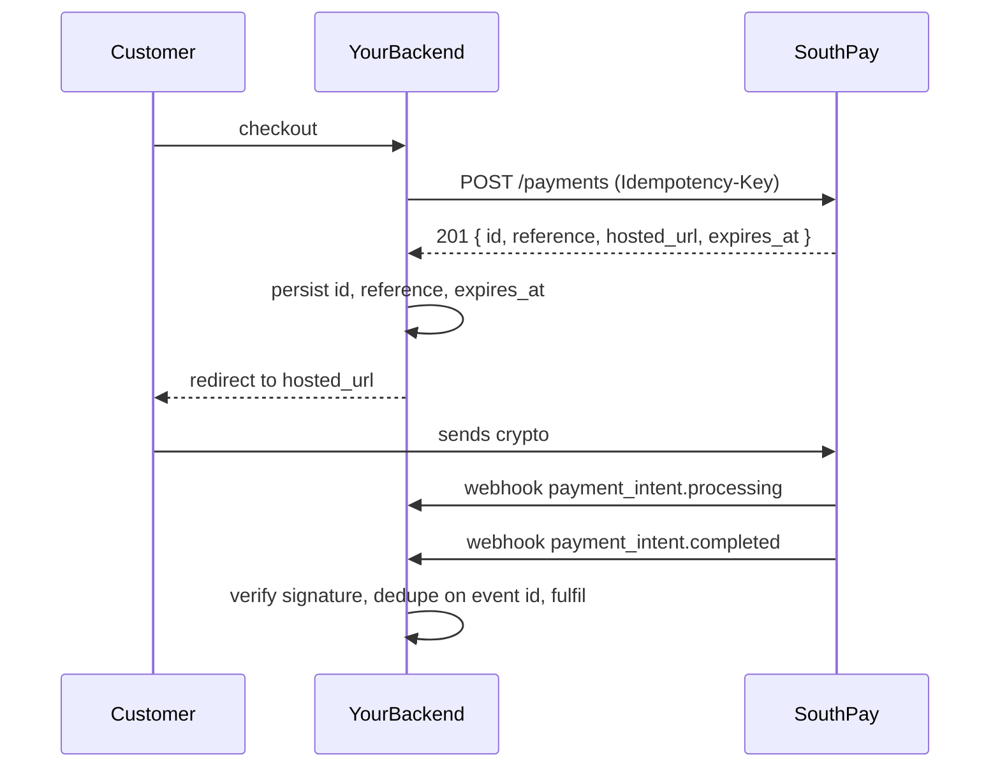

A payment intent is a single payment request. You give it a fiat amount and currency. SouthPay allocates a deposit address for every crypto asset your store has enabled, locks an exchange rate against each one, and returns a hosted checkout URL.

Which assets appear is a property of your store, not of the request. You cannot pick them per intent, and the customer chooses one at checkout. See [Supported currencies and assets](/currencies).

## Create

```http
POST /api/v2/payments
Authorization: Bearer sp_sk_test_YOUR_KEY
Idempotency-Key: test-8f14e45f-order-8721
Content-Type: application/json
```

Every field goes inside a required `payment_intent` object.

<ParamField body="amount" type="string" required>
  Fiat amount in major units, as a decimal string: `"149.00"`. Must be greater than zero. Multiplied by 100 into `settlement_amount_cents` internally.
</ParamField>

<ParamField body="currency" type="string" required>
  One of `USD`, `EUR`, `GBP`, `HKD`, `SGD`, `JPY`, `DKK`, `CHF`, `SEK`, `NOK`. Upcased for you. Anything else is `422`.
</ParamField>

<ParamField body="success_url" type="string">
  Where the hosted checkout sends the customer after a completed payment.
</ParamField>

<ParamField body="failed_url" type="string">
  Where the hosted checkout sends the customer after a failed or expired payment.
</ParamField>

<ParamField body="order_id" type="string">
  Your own order identifier, up to 255 characters. Indexed, so you can filter the list endpoint by it, which `metadata` does not allow.
</ParamField>

<ParamField body="title" type="string">
  Shown on the checkout page and the PDF invoice. Up to 150 characters.
</ParamField>

<ParamField body="description" type="string">
  Shown on the checkout page. Up to 500 characters.
</ParamField>

<ParamField body="image_url" type="string">
  Product or order image for the checkout page. **Must be `https`**, up to 2048 characters. Returned as `display_image_url`.
</ParamField>

<ParamField body="metadata" type="object">
  Up to 50 keys. **Every value must be a string**. A number or a nested object returns `422 "metadata values must be strings"`. Returned verbatim on the intent and in every webhook.
</ParamField>

<ParamField body="line_items" type="array">
  Up to 50 items, rendered as an order summary on checkout.
  <Expandable title="item">
    <ParamField body="description" type="string" required>Up to 255 characters.</ParamField>
    <ParamField body="quantity" type="integer" required>Positive integer.</ParamField>
    <ParamField body="unit_amount_cents" type="integer" required>Non-negative minor units.</ParamField>
    <ParamField body="image_url" type="string">Optional, `https` only.</ParamField>
  </Expandable>
</ParamField>

`Idempotency-Key` is optional here and strongly recommended. Read [Idempotency](/idempotency) first. A replay returns `201` with the original intent, and a changed amount under the same key is discarded without an error.

<CodeGroup>
```bash Request
curl -X POST https://api.southpay.io/api/v2/payments \
  -H "Authorization: Bearer sp_sk_test_YOUR_KEY" \
  -H "Idempotency-Key: test-8f14e45f-order-8721" \
  -H "Content-Type: application/json" \
  -d '{
    "payment_intent": {
      "amount": "149.00",
      "currency": "USD",
      "order_id": "order_8721",
      "title": "Annual plan",
      "success_url": "https://yourapp.example/success",
      "failed_url": "https://yourapp.example/cancel",
      "metadata": { "customer_id": "4421" },
      "line_items": [
        { "description": "Annual plan", "quantity": 1, "unit_amount_cents": 14900 }
      ]
    }
  }'
```

```json Response 201
{
  "id": "9c1d7f42-6a3b-4e58-9f10-2b8c5d4e7a91",
  "reference": "K4TP9WQZ2XR7HB3M",
  "hosted_url": "https://pay.southpay.io/K4TP9WQZ2XR7HB3M",
  "status": "pending",
  "state_reason": null,
  "settlement_currency": "USD",
  "settlement_amount": "149.00",
  "expires_at": "2026-08-07T15:00:00.000Z",
  "created_at": "2026-08-07T14:00:00.000Z",
  "success_url": "https://yourapp.example/success",
  "failed_url": "https://yourapp.example/cancel",
  "order_id": "order_8721",
  "title": "Annual plan",
  "description": null,
  "terminal": false,
  "settlement_status": null,
  "auto_swap_status": null,
  "reconciliation_status": null,
  "payment_addresses": [
    {
      "id": "3f2a8b19-40cd-4c7e-8a55-11d9e6b0c342",
      "address": "0xAbCdEf1234567890AbCdEf1234567890AbCdEf12",
      "status": "pending",
      "crypto_amount_atomic": "67164300000000000",
      "exchange_rate_snapshot": "2218.500000000000000000",
      "created_at": "2026-08-07T14:00:00.000Z",
      "supported_asset": {
        "asset_id": "ETH",
        "coin_symbol": "ETH",
        "chain_symbol": "ETH",
        "token_standard": "Native",
        "chain_name": "Ethereum",
        "network": "ethereum",
        "atomic_decimals": 18,
        "min_withdrawal_atomic": "10000000000000000",
        "fiat_eligible": false
      }
    },
    {
      "id": "8e0b64d3-71fa-4c92-b03e-5a7d19c6f284",
      "address": "0xAbCdEf1234567890AbCdEf1234567890AbCdEf12",
      "status": "pending",
      "crypto_amount_atomic": "149000000",
      "exchange_rate_snapshot": "1.000000000000000000",
      "created_at": "2026-08-07T14:00:00.000Z",
      "supported_asset": {
        "asset_id": "ETH_USDC",
        "coin_symbol": "USDC",
        "chain_symbol": "ETH",
        "token_standard": "ERC20",
        "chain_name": "Ethereum",
        "network": "ethereum",
        "atomic_decimals": 6,
        "min_withdrawal_atomic": "1000000",
        "fiat_eligible": true
      }
    }
  ]
}
```
</CodeGroup>

<Note>
EVM assets share one deposit address across chains, so two addresses on the same intent can be the same string. They are still distinct records with distinct amounts and distinct assets. Match a received payment on `(address, asset)`, never on address alone.
</Note>

### Response fields

<ResponseField name="id" type="string (UUID)" required>
  The identifier for every subsequent API call. A bare UUID, with no `pi_` prefix.
</ResponseField>

<ResponseField name="reference" type="string" required>
  Sixteen uppercase alphanumeric characters. The checkout token, the customer-facing identifier, and the value that arrives as `data.object.id` in webhooks.
</ResponseField>

<ResponseField name="hosted_url" type="string">
  The hosted checkout page. Redirect here rather than composing the URL yourself.
</ResponseField>

<ResponseField name="status" type="string" required>
  One of six values. See [Payment lifecycle](/payment-lifecycle).
</ResponseField>

<ResponseField name="state_reason" type="string | null">
  Why the intent is in its current status. Ten possible values, including `completed_overpaid` and `canceled_by_agent`.
</ResponseField>

<ResponseField name="settlement_amount" type="string">
  The fiat amount, formatted to two decimal places. Note that the **webhook** envelope carries `settlement_amount_cents` as an integer instead.
</ResponseField>

<ResponseField name="expires_at" type="string (ISO 8601)">
  Sixty minutes after `created_at`, always. Not configurable.
</ResponseField>

<ResponseField name="terminal" type="boolean">
  `true` for `completed`, `expired`, `failed` and `refunded`. Means the outcome is settled, not that the record is frozen. Any of them can still become `refunded`.
</ResponseField>

<ResponseField name="payment_addresses" type="array">
  One entry per enabled asset that had a live rate at creation time.
  <Expandable title="properties" defaultOpen>
    <ResponseField name="address" type="string">The on-chain deposit address.</ResponseField>
    <ResponseField name="crypto_amount_atomic" type="string">Exact amount due, in the asset's smallest unit, as a string.</ResponseField>
    <ResponseField name="exchange_rate_snapshot" type="string">The rate locked at creation, as a plain numeric string with 18 decimal places. Not an object.</ResponseField>
    <ResponseField name="status" type="string">`pending` or `confirmed`.</ResponseField>
    <ResponseField name="supported_asset" type="object">`asset_id`, `coin_symbol`, `chain_symbol`, `token_standard`, `chain_name`, `network`, `atomic_decimals`, `min_withdrawal_atomic`, `settlement_currency`, `fiat_eligible`.</ResponseField>
  </Expandable>
</ResponseField>

<ResponseField name="settlement_status" type="string | null">
  `pending`, `processing`, `completed` or `failed`. Never `settled`.
</ResponseField>

<ResponseField name="auto_swap_status" type="string | null">
  `completed`, `pending`, `failed` or `skipped`.
</ResponseField>

<ResponseField name="reconciliation_status" type="string | null">
  `final`, `under_investigation`, `disputed` or `closed`.
</ResponseField>

An asset with no live rate at creation time is **omitted** rather than failing the request. If you expect five addresses and get four, a rate lookup failed for the fifth.

### Converting atomic amounts

```typescript
const address = intent.payment_addresses[0];
const decimals = address.supported_asset.atomic_decimals;
const units = BigInt(address.crypto_amount_atomic);

const human = `${units / 10n ** BigInt(decimals)}.${(units % 10n ** BigInt(decimals))
  .toString()
  .padStart(decimals, "0")}`;
```

Do not put an atomic amount through `Number`. An 18-decimal value exceeds `Number.MAX_SAFE_INTEGER` and you will display the wrong figure.

### Failures on create

| Status | Cause |
| --- | --- |
| `403` `insufficient_scope` | The credential lacks `payments:write` |
| `403` `publishable_key_forbidden` | A `sp_pk_` key on any endpoint other than this one |
| `422` | Missing or non-positive amount, unsupported currency, a field over its length limit, non-string metadata values, a non-`https` `image_url`, or a malformed `line_items` array |
| `429` | This endpoint is throttled at 120 requests per minute per credential. No `Retry-After` is set. |

Most of these arrive as `{"error": "<plain string>"}`. See [Errors](/errors).

## Send the customer to checkout

Redirect to `hosted_url`, which resolves to `https://pay.southpay.io/{reference}`.

The page shows a QR code and the exact amount for every address on the intent, updates as confirmations land, and redirects to your `success_url` on completion. There is no frontend work.

`GET /api/v2/checkout/{reference}` is the JSON behind that page. It is public, unauthenticated, and lazily expires a `pending` intent whose window has closed. Use it if you are building your own checkout UI; do not send customers to it.

## Retrieve

```bash
curl https://api.southpay.io/api/v2/payments/9c1d7f42-6a3b-4e58-9f10-2b8c5d4e7a91 \
  -H "Authorization: Bearer sp_sk_test_YOUR_KEY"
```

The single-intent read returns a considerably richer object than create does. On top of every field above:

| Field | Contents |
| --- | --- |
| `line_items`, `display_image_url`, `metadata` | What you sent at creation |
| `customer_pays_fee` | Whether the fee is added on top of the customer's amount |
| `fee` | `fee_atomic`, `fee_percentage`, `asset_id` |
| `financials` | `gross_amount`, `fee_amount`, `net_amount`, `fee_percentage`, `currency`, `asset_id`, `exchange_rate` |
| `transaction` | `tx_hash`, `from_address`, `deposit_address`, `confirmations`, `required_confirmations`, `status`, `coin_symbol`, `chain_symbol`, `chain_name`, `network`, `explorer_url`, `confirmed_at` |
| `overpayment` | `required_atomic`, `received_atomic`, `excess_atomic`, `asset_id`, `coin_symbol`, `atomic_decimals` |
| `amount_paid`, `paid_at` | What actually arrived, and when |
| `merchant` | Your store's legal details, as rendered on the invoice |
| `payment_events`, `timeline` | The transition history |
| `auto_swap_detail` | The swap, if one ran |
| `onramp_session`, `onramp_unavailable` | [Card payment](/card-payments) funding state, where enabled |

`transaction.status` uses the transaction state set: `pending`, `confirming`, `confirmed`, `submitted`, `failed`. `confirming` is a transaction status and never a payment intent status.

## Cancel

Closes a payment's window early instead of waiting for it to expire on its own.

```bash
curl -X POST https://api.southpay.io/api/v2/payments/9c1d7f42-6a3b-4e58-9f10-2b8c5d4e7a91/cancel \
  -H "Authorization: Bearer sp_sk_test_YOUR_KEY"
```

A `pending` payment — one where nothing has arrived on-chain yet — becomes `expired` with `state_reason: "canceled_by_merchant"`. There is no `canceled` status; see [Payment lifecycle](/payment-lifecycle#state-reasons). The response is the same detail object as [Retrieve](#retrieve), so you can read the resulting status straight off it.

Cancelling also pulls `expires_at` back to now. That is what the status change means: the window is over.

### Payments that already have funds

Once any transaction is seen on-chain the payment is `processing`, and a plain cancel returns `422` — you cannot void money that is already moving. To close it out anyway, force it:

```bash
curl -X POST "https://api.southpay.io/api/v2/payments/{id}/cancel?force=true" \
  -H "Authorization: Bearer sp_sk_test_YOUR_KEY"
```

`force=true` brings the deadline forward and resolves the payment down **exactly the path a natural expiry takes**:

| Your store setting | Result |
| --- | --- |
| Accepts underpayments | `completed` with `state_reason: "completed_underpaid"`, and the funds settle |
| Rejects underpayments | `failed` with `state_reason: "failed_underpaid"`, and a refund is initiated automatically |

<Warning>
`force=true` can therefore **complete** a payment rather than cancel it, if funds arrived and your store accepts underpayments. Read the `status` on the response rather than assuming the payment is dead.
</Warning>

<Warning>
Forcing while a transaction is still confirming ends the payment before the chain settles it. A confirmation that lands afterwards has no open intent to attach to and becomes an unmatched deposit requiring manual reconciliation. Prefer letting `processing` payments finish on their own, and reach for `force` only when you know nothing further is coming.
</Warning>

A payment that is already `completed`, `expired`, `failed` or `refunded` returns `422` with or without `force`. To reverse one of those, [create a refund](#related-operations) instead.

Cancels emit `payment_intent.expired`, the same event a natural expiry emits — if you already handle expiry you already handle cancels. Branch on `state_reason` to tell them apart.

## List

```bash
curl "https://api.southpay.io/api/v2/payments?status=completed&per_page=50" \
  -H "Authorization: Bearer sp_sk_test_YOUR_KEY"
```

<ParamField query="page" type="integer" default="1" />
<ParamField query="per_page" type="integer" default="10">Maximum 100.</ParamField>
<ParamField query="status" type="string">One of the six statuses. `confirming` is accepted but always matches zero rows.</ParamField>
<ParamField query="q" type="string">Case-insensitive substring match on `reference`.</ParamField>
<ParamField query="order_id" type="string">Exact match.</ParamField>
<ParamField query="from" type="string">ISO date. Inclusive.</ParamField>
<ParamField query="to" type="string">ISO date. Inclusive.</ParamField>

Results are newest first, scoped to the credential's store and mode.

```json Response 200
{
  "data": [ { "id": "…", "status": "completed" } ],
  "meta": { "total": 214, "page": 1, "per_page": 50, "total_pages": 5 }
}
```

<Warning>
Pagination envelopes are not consistent across this API. Payments, billing and platform endpoints use `meta`. Payouts, balance swaps and x402 use `pagination`. Balances, payout schedules and billing subscriptions return a **bare array with no pagination at all**. Do not write one shared pager.
</Warning>

## Event history

```bash
curl https://api.southpay.io/api/v2/payments/{id}/events \
  -H "Authorization: Bearer sp_sk_test_YOUR_KEY"
```

Returns a bare array, oldest first. `event_type` values match [webhook event names](/webhooks#event-catalogue) exactly, so you can reconcile this log against the deliveries you received.

```json Response 200
[
  {
    "id": "1a0f8e64-3b57-4d92-b7c0-2e6a54d9f831",
    "event_type": "payment_intent.created",
    "from_status": null,
    "to_status": "pending",
    "payload": {},
    "created_at": "2026-08-07T14:00:00.000Z"
  },
  {
    "id": "6d3c9b21-58ae-4f07-9130-4c8b7e2a06d5",
    "event_type": "payment_intent.completed",
    "from_status": "processing",
    "to_status": "completed",
    "payload": { "state_reason": "completed_exact" },
    "created_at": "2026-08-07T14:07:00.000Z"
  }
]
```

This log contains events that no webhook endpoint can subscribe to, such as `payment_intent.underpaid_detected`. It is the more complete record of the two.

## Related operations

| Operation | Endpoint | Scope |
| --- | --- | --- |
| Cancel a payment | `POST /api/v2/payments/{id}/cancel` | `payments:write` |
| PDF invoice (binary) | `GET /api/v2/payments/{id}/invoice` | `payments:read` |
| List refunds | `GET /api/v2/payments/{id}/refunds` | `refunds:read` |
| Create a refund | `POST /api/v2/payments/{id}/refunds` | `refunds:write` |
| Reconciliation snapshot | `GET /api/v2/payment_intents/{id}/reconciliation` | `payments:read` |
| Aggregate summary | `GET /api/v2/payments/summary` | `payments:read` |

<Note>
The reconciliation route uses the path segment `payment_intents`, while every other payment route uses `payments`. That inconsistency is real; the route will 404 if you normalise it.
</Note>

Creating a refund **requires** an `Idempotency-Key` header. Without one you get `422`.

## Integration shape


```mermaid
sequenceDiagram
  participant Customer
  participant YourBackend
  participant SouthPay

  Customer->>YourBackend: checkout
  YourBackend->>SouthPay: POST /payments (Idempotency-Key)
  SouthPay-->>YourBackend: 201 { id, reference, hosted_url, expires_at }
  YourBackend->>YourBackend: persist id, reference, expires_at
  YourBackend-->>Customer: redirect to hosted_url

  Customer->>SouthPay: sends crypto
  SouthPay->>YourBackend: webhook payment_intent.processing
  SouthPay->>YourBackend: webhook payment_intent.completed
  YourBackend->>YourBackend: verify signature, dedupe on event id, fulfil
```

Persist `id`, `reference` and `expires_at` before you redirect. The webhook identifies the intent by `reference`, and you will need the `id` for every read.

See [Best practices](/best-practices) for the rest.
