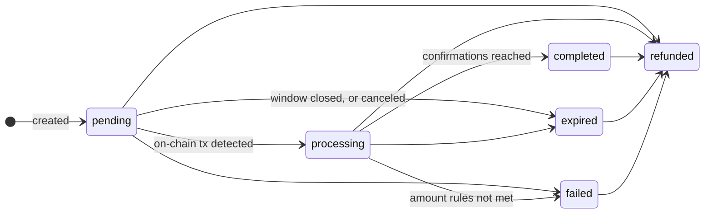

This is the canonical reference for payment intent state. Every other page links here rather than restating it.

## The six statuses

A payment intent has exactly six statuses. There is no `created`, no `confirming` and no `overpaid`.

| Status | `terminal` | Meaning |
| --- | --- | --- |
| `pending` | `false` | Created. Deposit addresses issued, waiting for the customer to send funds. |
| `processing` | `false` | At least one transaction for a deposit address is confirming or confirmed on-chain. |
| `completed` | `true` | Enough confirmed funds received. Credited to your balance. |
| `expired` | `true` | The window closed without a usable payment, or the intent was canceled. |
| `failed` | `true` | Funds arrived but the intent could not complete under your store's rules. |
| `refunded` | `true` | A refund confirmed on-chain. |

<Warning>
`terminal: true` means "this outcome is settled", not "this record will never change again". Any of the four terminal statuses can still move to `refunded` later. Treat `refunded` as an update to an order you already fulfilled, not as an impossible transition.
</Warning>

## Transitions

| From | Allowed to |
| --- | --- |
| `pending` | `processing`, `expired`, `failed`, `refunded` |
| `processing` | `completed`, `failed`, `expired`, `refunded` |
| `completed` | `refunded` |
| `expired` | `refunded` |
| `failed` | `refunded` |

Status never moves backwards. `completed` never returns to `processing`.

## Expiry defaults to 60 minutes

Every payment intent expires 60 minutes after it is created unless you send `expires_in` on [create](/api-reference/payments#create-a-payment-intent). The exact moment is on the intent as `expires_at`; read that field rather than computing it yourself.

`expires_in` is in seconds, from `300` (5 minutes) to `86400` (24 hours). It is a create-time input only: there is no endpoint to extend a live intent, so if a customer needs longer, create a second intent with a new [idempotency key](/idempotency).

The crypto amounts are quoted when the intent is created and stay fixed for the whole window, so a longer window leaves you exposed to more exchange-rate movement. A customer who funds the payment by card can push `expires_at` out to 6 hours regardless of what you set, because the card leg needs that time to settle.

Expiry is applied lazily. A `pending` intent past its `expires_at` flips to `expired` the next time it is loaded, including when the customer opens the hosted checkout page, so a stale `pending` in your database may already be dead. Trust `expires_at` over `status`.

## State reasons

`state_reason` is the machine-readable "why" behind the current status. It has eleven values.

| `state_reason` | Status | Meaning |
| --- | --- | --- |
| `pending_confirmations` | `processing` | Transaction seen, waiting for the chain's required confirmations |
| `processing_underpaid` | `processing` | Confirmed funds received, still short of the required amount |
| `completed_exact` | `completed` | The required amount arrived |
| `completed_overpaid` | `completed` | More than required arrived, and your store accepts overpayments |
| `completed_underpaid` | `completed` | Less than required arrived, and your store accepts underpayments |
| `failed_underpaid` | `failed` | Underpaid, and your store does not accept underpayments |
| `failed_overpaid` | `failed` | Overpaid, and your store does not accept overpayments |
| `expired_timeout` | `expired` | The window closed with no usable payment |
| `canceled_by_agent` | `expired` | An [agent](/agentic/index) canceled a `pending` intent |
| `canceled_by_merchant` | `expired` | You canceled a `pending` intent via [`POST /payments/{id}/cancel`](/payment-intents#canceling-a-payment) |
| `refund_completed` | `refunded` | A refund confirmed on-chain |

**Overpayment is not a status.** An accepted overpayment is `status: "completed"` with `state_reason: "completed_overpaid"`, and the `:detail` view of the intent carries an `overpayment` object with the excess. If you branch on `status === "completed"` and ignore `state_reason`, you will fulfil overpaid and underpaid orders identically, which may or may not be what you want.

**Cancels land in `expired`, not in a cancel status.** There is no `canceled` status. A cancel is modelled as an early expiry, and the reason tells you who did it: `canceled_by_agent` for an agent, `canceled_by_merchant` for you.

## Related status fields

A payment intent carries four other status-shaped fields. None of them are the payment status.

| Field | Values | What it tracks |
| --- | --- | --- |
| `settlement_status` | `pending`, `processing`, `completed`, `failed`, `null` | Movement of the received funds into your settlement balance. Never `settled`. |
| `auto_swap_status` | `completed`, `pending`, `failed`, `skipped`, `null` | An automatic swap of the received asset into your target stablecoin |
| `reconciliation_status` | `final`, `under_investigation`, `disputed`, `closed`, `null` | The reconciliation snapshot for the intent |
| `payment_addresses[].status` | `pending`, `confirmed` | Whether that specific deposit address received funds |

Transactions have their own statuses (`pending`, `confirming`, `confirmed`, `submitted`, `failed`) exposed under `transaction` on the intent detail view. `confirming` is a **transaction** status. It is not a payment intent status.

<Note>
`GET /api/v2/payments?status=confirming` is accepted by the list filter but always returns zero rows, because no payment intent ever holds that value. It is a dead filter value.
</Note>

## Matching statuses to webhook events

| Transition | Event |
| --- | --- |
| → `pending` | `payment_intent.created` |
| → `processing` | `payment_intent.processing` |
| → `completed` | `payment_intent.completed` |
| → `expired` | `payment_intent.expired` |
| → `failed` | `payment_intent.failed` |
| → `refunded` | `payment_intent.refunded` |

A merchant cancel emits `payment_intent.expired`, exactly like a natural expiry — if you already handle expiry, you already handle cancels. Check `state_reason` to tell them apart.

The **agentic** cancel path is the exception: it emits `payment_intent.canceled`, which **cannot be subscribed to**. See [Webhooks](/webhooks#events-you-cannot-receive). Watch for `payment_intent.expired` with `state_reason: "canceled_by_agent"` instead.
